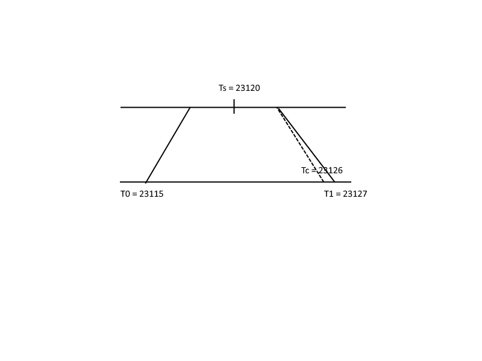
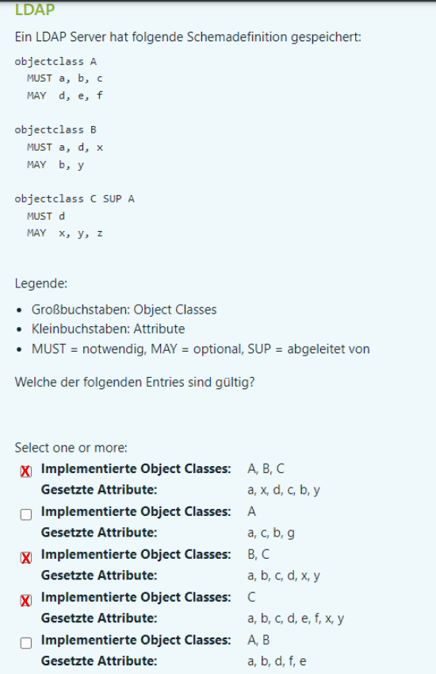
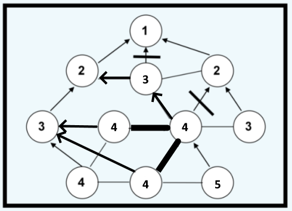

1. Analysieren sie folgendes C-Promm. Welche Fehler können Sie identifizieren (Zeilennummer + Fehlerbeschreibung)? Sie müssen den Code nicht ändern oder erweitern, sondern nur die Fehler beschreiben und die resultierenden möglichen Probleme aufzeigen.

``` cpp
#include "myheader.h" 
#define BUF 1024
#define PORT 6543

int main(void){
    int cs, ns;
    socklen_t addrlen;
    char buffer[BUF];
    struct sockaddr_in addr, cl;
    pid_t pid;

    cs = socket(AF_INET, SOCK_STREAM,0);

    addr.sin_family = AF_INET;

    addr.sin_addr.s_addr = inet_addr("127.0.0.1");//addr.sin_addr.s_addr = "127.0.0.1";
    
    addr.sin_port = htons(PORT);//addr.sin_port = PORT;

    bind(cs,(struct sockaddr*)&addr,sizeof(addr));//Error handling? 

    listen(cs,5);//Error handling? 

    addrlen = sizeof(struct sockaddr_in);

    while(1){//Endlosschleife while(1)?
        printf("Waiting for connections\n");
        ns = accept(cs,(struct sockaddr*)&cl, &addrlen);
        if((pid=fork()) == 0){
        do{
            recv(ns,buffer,BUF-1,0);//recv(ns,buffer,BUF,0);
            buffer[BUF-1] = '\0';//buffer[BUF-1] = '\0';
            printf("Message received: %s",buffer);
        }while(strncmp(buffer, "quit",4) != 0);
        close(ns);//close(cs);
        }
    }
    close(cs);
    return EXIT_SUCCESS;
}
```
Die gegebene C++-Zeile versucht, einen String-Literal "127.0.0.1" einer Variable des falschen Typs zuzuweisen. Um eine IP-Adresse in einer sockaddr_in-Struktur zu setzen, sollte inet_addr oder inet_pton verwendet werden, um die Zeichenkette in das korrekte numerische Format umzuwandeln.

``` cpp
15 addr.sin_addr.s_addr = "127.0.0.1";
15 addr.sin_addr.s_addr = inet_addr("127.0.0.1");
```
Die Codezeile addr.sin_port = PORT;, wenn #define PORT 23123 verwendet wird, könnte aufgrund einer möglichen Überlaufsituation scheitern, da der Portwert außerhalb des gültigen Bereichs für einen 16-Bit-Port liegen könnte. Es wird empfohlen, htons(PORT) zu verwenden, um sicherzustellen, dass der Portwert im richtigen Netzwerkformat liegt und innerhalb des gültigen Bereichs für einen Port liegt.

``` cpp
16 addr.sin_port = PORT;
16 addr.sin_port = htons(PORT);
```
Hier sollte eventuell Error Handling eingebaut werden, bei einem Fehlschlag wird -1 zurückgegeben und das Programm soll abgebrochen werden ansonsten kann Programm weiterlaufen.

``` cpp
18 bind(cs,(struct sockaddr*)&addr,sizeof(addr));

if(bind(cs,(struct sockaddr*)&addr,sizeof(addr)) == -1){
    fprintf(stderr,"Error occoured while binding serversocket");
}
```
Auch hier wird kein Error Handling betrieben.

``` cpp
19 listen(cs,5);

if(listen(cs,5); == -1){
    fprintf(stderr,"Error occoured while listening for clients");
}
```
Endlosschleife macht in diesem Fall vielleicht wenig Sinn, hier würde ich Vorschlagen, einen Index zu erstellen, der bis 5 Clients hochzählt und dann, mit waitpid() warten bis alle Clients terminiert sind und dann serversocket schließen und mit EXIT_SUCCESS Programm beenden.

``` cpp
23 while(1){}
int i = 0;
while(i < 5){
    .
    .
    .
    i++;
}
int status;
pid_t child_pid;
while ((child_pid = waitpid(-1, &status, 0)) > 0) {
    if (WIFEXITED(status)) {
        std::cout << "Child process " << child_pid << " terminated with status: " << WEXITSTATUS(status) << std::endl;
    } else if (WIFSIGNALED(status)) {
        std::cout << "Child process " << child_pid << " terminated by signal: " << WTERMSIG(status) << std::endl;
    }
}
```
Das letzte Element enthält keinen Null Terminator, es könnte also zu undefiniertem Verhalten kommen, da auf Speicheradressen zugegriffen wird, auf die nicht zugegriffen werden sollte. Daher muss 1 vom Buffer abgezogen werden und das letzte Element mit einem NUll Terminator versehen werden.

``` cpp
28 recv(ns,buffer,BUF,0);
28 recv(ns,buffer,BUF-1,0);
29 buffer[BUF-1] = '\0';
```
Hier wird der Serversocket geschlossen obwohl man hier eigentlich den Client schließen möchte.

``` cpp
31 close(cs);
close(ns);
```

2. Klassifizieren Sie den Servertyp des untenstehenden C-Programms anhand der folgenden KAtegorien und begründen Sie Ihre Entscheidung:
- stateful/stateless
- connection oriented/connectionless
- iterative/concurrent

Stateful/Stateless:
The server maintains state by accepting multiple connections in a loop and creating a child process for each connection using fork(). Each child process handles its connection independently. The child processes share the same file descriptors, so they may share some state.
It's more accurate to say that each connection handled by a child process is stateful for the duration of that connection, but the overall server can be considered stateless between different connections.
Connection 

Oriented/Connectionless:
The server uses TCP (SOCK_STREAM), which is a connection-oriented protocol. This means that a reliable, two-way communication channel is established between the server and the client.

Iterative/Concurrent:
The server is concurrent because it uses fork() to create a new process for each incoming connection. This allows the server to handle multiple connections simultaneously.

In summary:
Stateful/Stateless: Stateless overall but stateful during each connection.
Connection Oriented/Connectionless: Connection-oriented (uses TCP).
Iterative/Concurrent: Concurrent (uses fork for handling multiple connections simultaneously).

---

NTP
Reorganisiren Sie das folgende NTP Netzwerk, sodass der Ausfall der Verbindungen (markiert mit einem dicken Querstrich) bestmöglich kompensiert wird:
- Kreis mit ZIffer: Knoten mit entsprechendem Stratum
- Pfeil: verbundener Peer
- Linie: mögliche Netzwerkverbindung


---

Ldap
1. Geben sie einen syntaktisch korrekten LDAP Suchfilter an, der alle Einträge des LDAP Verzeichnisses mit der Suchbasis "dc=technikum-wien,dc=at" liefert, deren Nachname (Attribut sn) mit M oder N beginnen und die in der Organisationseinheit (Attribut) BMR oder BWI zu finden sind.

(&(objectClass=*)(sn=M* | sn=N*)(|(ou=BMR)(ou=BWI))(dc=technikum-wien,dc=at))

Hier eine Erklärung der Bestandteile des Filters:

- (&(objectClass=*)...): Stellt sicher, dass die Einträge mindestens eine Objektklasse haben.
- (sn=M* | sn=N*): Sucht nach Einträgen, deren Nachname mit M oder N beginnt.
- (|(ou=BMR)(ou=BWI)): Überprüft, ob die Einträge in einer der Organisationseinheiten BMR oder BWI zu finden sind.
- (dc=technikum-wien,dc=at): Setzt die Suchbasis auf "dc=technikum-wien,dc=at".

2. Wie unterscheidet sich eine Ausgabe wenn die Abfrage nicht anonym sondern mit Authentifizierung durchgeführt wird?

?

---

Getopt
1. Ein Programm soll als Optionen -q und -c CONFIGDATEI sowie die Angabe eines Verzeochnisses haben. Wie muss die getopt() Funktion aufgerufen werden, um die Kommandozeile zu analysieren?

``` cpp
#include <iostream>
#include <unistd.h>

int main(int argc, char *argv[]) {
    int opt;
    std::string configFileName;

    while ((opt = getopt(argc, argv, "qc:")) != -1) {
        switch (opt) {
            case 'q':
                // Option -q gefunden
                std::cout << "Option -q gefunden" << std::endl;
                break;
            case 'c':
                // Option -c gefunden, optarg enthält den Dateinamen
                configFileName = optarg;
                std::cout << "Option -c mit Konfigurationsdatei: " << configFileName << std::endl;
                break;
            default:
                // Unbekannte Option oder Fehler
                std::cerr << "Unbekannte Option oder Fehler" << std::endl;
                return 1;
        }
    }

    // Hier kannst du mit dem Wert von optind auf das Verzeichnis zugreifen, falls vorhanden
    if (optind < argc) {
        std::string directoryName = argv[optind];
        std::cout << "Verzeichnis: " << directoryName << std::endl;
    }

    return 0;
}
```


2. Wie ermitteln Sie den Verzeichnisname in diesem Beispiel?

``` cpp
if (optind < argc) {
    std::string directoryName = argv[optind];
    std::cout << "Verzeichnis: " << directoryName << std::endl;
}
```

---

Zeitsynchronisation
1. Berechnen Sie die neue Zeit Tc eines Clients nach dem Algorithmus von Christian. Die Sendezeit des Clients T0=23115. DIe EMpfangszeit des CLients T1=23127. Der Reply des Servers enthält die Serverzeit Ts=23120

Tc = Ts + (T1-T0)/2
Tc = 23120 + (23127-23115)/2
Tc = 23126

2. Skizzieren Sie diesen Request mittels Zeitachse für CLient und Server. Zeichnen Sie die obenstehenden ZAhlen und ihre Ergebnis in die Skizze ein.



4. Wie groß wäre der Fehler bei einer symmetrischen Übertragungsdauer und wie groß bei einer asymmetrischen Übertragungsdauer?

Bei einer symmetrischen Übertragungsdauer ist der Fehler |Tc - Ts| = ∣23126 − 23120∣ = 6, Fehler beträgt also 6 Einheiten

Bei der asymmetrischen wäre der Fehler |Ts-T0 + (T1-T0)/2| = 1

---
1. Beschreiben SIe die exakte Ausgabe auf stdout. Ist die Ausgabenreienfolge varaibel oder immer ident? Begründen Sie ihre Antwort.

``` cpp
#include <sys/types.h>
#include <unistd.h>
#include <stdio.h>

int main(){
    pid_t pid;
    int a = 12;
    int b = 5;
    pid = fork();
    switch(pid){
        case -1:
            printf("fork failed"); 
            return -1;
            break;
        case 0:
            sleep(3);
            b = a+1;
            printf("2: a: %d b: %d\n",a,b);
            break;
        default:
            sleep(1);
            a = 3;
            b = 5;
            printf("1: a: %d b: %d\n",a,b);
            break;
    }
    a++;
    b--;
    printf("3: a: %d b: %d\n",a,b);
    return 0;
}
```
Laut mehrfachem Ausführem in der Konsole ist die Ausgabe immer gleich. Dem Aspekt nach zu beurteilen ist die  Ausgabe immer ident.

``` cpp
1: a: 3 b: 5
3: a: 4 b: 4
2: a: 12 b: 13
3: a: 13 b: 12
```


2. Welche Programmierrichtlinie für parallele Prozesse wird verletzt? Erweitern Sie das Programm entsprechend.

Das gegebene Programm verletzt die Programmierrichtlinie für parallele Prozesse, die besagt, dass gemeinsam genutzte Ressourcen, wie z.B. Variablen, durch Mutexe oder andere Mechanismen geschützt werden sollten, um Dateninkonsistenzen und Wettlaufbedingungen zu verhindern.

In diesem Fall teilen sich der Eltern- und der Kindprozess die Variablen `a` und `b` ohne Synchronisierung. Dies könnte zu unvorhersehbarem Verhalten führen, da beide Prozesse gleichzeitig auf die Variablen zugreifen und modifizieren.

Um dies zu beheben, können Sie Mutexe verwenden, um den kritischen Abschnitt zu schützen. Hier ist eine erweiterte Version des Programms mit Mutexen:

```c
#include <sys/types.h>
#include <unistd.h>
#include <stdio.h>
#include <pthread.h>

// Mutex für den kritischen Abschnitt
pthread_mutex_t mutex = PTHREAD_MUTEX_INITIALIZER;

int main() {
    pid_t pid;
    int a = 12;
    int b = 5;
    pid = fork();

    switch (pid) {
    case -1:
        printf("fork failed");
        return -1;
        break;
    case 0:
        sleep(3);
        // Kindprozess: Lock den Mutex, um auf gemeinsame Variablen zuzugreifen
        pthread_mutex_lock(&mutex);
        b = a + 1;
        printf("2: a: %d b: %d\n", a, b);
        pthread_mutex_unlock(&mutex); // Unlock den Mutex
        break;
    default:
        sleep(1);
        // Elternprozess: Lock den Mutex, um auf gemeinsame Variablen zuzugreifen
        pthread_mutex_lock(&mutex);
        a = 3;
        b = 5;
        printf("1: a: %d b: %d\n", a, b);
        pthread_mutex_unlock(&mutex); // Unlock den Mutex
        break;
    }

    // Beide Prozesse können jetzt auf gemeinsame Variablen zugreifen, ohne Konflikte
    pthread_mutex_lock(&mutex);
    a++;
    b--;
    printf("3: a: %d b: %d\n", a, b);
    pthread_mutex_unlock(&mutex); // Unlock den Mutex

    return 0;
}
```

In dieser Version wurde ein Mutex (`mutex`) hinzugefügt, und der kritische Abschnitt, in dem auf gemeinsame Variablen zugegriffen wird, wird mit `pthread_mutex_lock` und `pthread_mutex_unlock` geschützt. Dies stellt sicher, dass nur ein Prozess gleichzeitig auf die gemeinsamen Variablen zugreifen kann, um Dateninkonsistenzen zu verhindern.

Oder

Verstoß gegen die Richtlinie das es zu Zombie Prozessen kommen kann, da der Eltern Prozess vor dem Child Prozess terminiert. 

``` cpp
wait(Null);
```

---



---

Socketprogrammierung

Wozu dienen die Funktionen ntohs(), ntohl()? Warum gibt es keine Funktion ntohstr() für Strings? Begründen Sie Ihre Antwort.

Die Funktionen `ntohs()` und `ntohl()` dienen der Konvertierung von Netzwerkbyte-Reihenfolge (Network Byte Order) in die Hostbyte-Reihenfolge. Diese Funktionen sind besonders wichtig, wenn Daten zwischen verschiedenen Rechnern oder Plattformen mit unterschiedlichen Endianness (Byte-Reihenfolge) übertragen werden.

- `ntohs()`: "Network to Host short" - Konvertiert einen 16-Bit-Wert von Netzwerkbyte-Reihenfolge in Hostbyte-Reihenfolge.
- `ntohl()`: "Network to Host long" - Konvertiert einen 32-Bit-Wert von Netzwerkbyte-Reihenfolge in Hostbyte-Reihenfolge.

Die Netzwerkbyte-Reihenfolge ist definiert als die Reihenfolge der Bytes, die in Netzwerkpaketen verwendet wird. Diese Reihenfolge ist standardmäßig "big-endian" (das MSB, das Most Significant Byte, kommt zuerst).

Warum gibt es keine Funktion `ntohstr()` für Strings?

Die Funktionen `ntohs()` und `ntohl()` sind darauf ausgelegt, Daten mit fester Länge (16 bzw. 32 Bit) zu konvertieren. Strings hingegen können unterschiedliche Längen haben und können auch Zeichenkodierungen (wie ASCII oder UTF-8) verwenden, die nicht direkt mit den Konzepten von "short" oder "long" in Verbindung stehen.

Wenn Sie eine Zeichenkette (String) aus dem Netzwerk empfangen, müssen Sie sicherstellen, dass die Zeichenkette selbst in der richtigen Zeichenkodierung ist. Die Endianness wird normalerweise nur für binäre Daten wie Zahlen relevant. Daher gibt es keine spezielle Funktion wie `ntohstr()` für Strings, da die Endianness nicht das primäre Problem bei der Übertragung von Zeichenketten zwischen Rechnern ist.

Für Zeichenkettenübertragungen über das Netzwerk sind andere Konzepte wie Textkodierung, Zeichensatz und Protokolle wie UTF-8 oder Base64 von größerer Bedeutung. In der Regel müssen Sie die Zeichenkodierung separat verwalten, wenn Sie mit Zeichenketten arbeiten, und es gibt Funktionen in vielen Programmiersprachen, um dies zu erleichtern (z. B. `iconv` in C oder Funktionen zur Zeichencodierung in höheren Ebenen von Netzwerkbibliotheken).

---

Welche Unterschiede gibt es zwischen Named und Unnamed Pipes? Nennen Sie 3 Unterscheide!

Named Pipes (auch FIFOs genannt) und Unnamed Pipes (auch anonyme Pipes genannt) sind beide Mechanismen zur Interprozesskommunikation (IPC) in Unix-basierten Betriebssystemen. Hier sind drei Hauptunterschiede zwischen Named und Unnamed Pipes:

1. **Benennung (Named vs. Unnamed):**
   - **Named Pipes:** Werden durch einen Dateinamen im Dateisystem identifiziert und existieren als Dateien. Sie werden mit dem Befehl `mkfifo` erstellt und können zwischen nicht-verwandten Prozessen für die Kommunikation verwendet werden.
   - **Unnamed Pipes:** Sind nicht durch einen Dateinamen im Dateisystem identifiziert. Sie werden durch den `pipe`-Systemaufruf erstellt und sind auf die Kommunikation zwischen einem Eltern- und einem Kindprozess beschränkt.

2. **Persistenz:**
   - **Named Pipes:** Haben eine persistente Existenz im Dateisystem und können über mehrere unabhängige Prozesse hinweg verwendet werden. Sie müssen explizit erstellt und gelöscht werden.
   - **Unnamed Pipes:** Existieren nur, solange die betreffenden Prozesse existieren. Sie werden normalerweise von einem Prozess erstellt und können nur zwischen verwandten Prozessen verwendet werden.

3. **Kommunikation zwischen nicht-verwandten Prozessen:**
   - **Named Pipes:** Ermöglichen die Kommunikation zwischen nicht-verwandten Prozessen, da sie durch einen Dateinamen identifiziert werden und dieser Dateiname im Dateisystem sichtbar ist.
   - **Unnamed Pipes:** Sind auf die Kommunikation zwischen verwandten Prozessen (Eltern und Kind) beschränkt. Sie teilen sich den Speicherbereich und sind daher nicht für die Kommunikation zwischen nicht-verwandten Prozessen geeignet.

Zusätzlich zu diesen Unterschieden gibt es auch Gemeinsamkeiten, wie zum Beispiel die Verwendung von `read` und `write` Operationen für die Datenübertragung und die Tatsache, dass beide Mechanismen Daten im Byte-Stream-Format übertragen. Der Auswahl zwischen Named und Unnamed Pipes hängt von den Anforderungen des konkreten Anwendungsfalls ab.

---

Eigenen sich Signale zu KOmmunikation zwischen Prozessen und zur Übermittlung größerer Datenmengen? Warum/Warum nicht?

Signale sind für die Kommunikation zwischen Prozessen geeignet, allerdings haben sie einige Einschränkungen, die ihre Verwendung in bestimmten Szenarien begrenzen. Hier sind einige Überlegungen:

### Für die Kommunikation zwischen Prozessen geeignet:

1. **Einfachheit:**
   - Signale sind einfach zu verwenden und erfordern nur den Aufruf von Funktionen wie `kill` oder `raise` in C.
   - Sie bieten eine einfache Möglichkeit, einem anderen Prozess eine Benachrichtigung zu senden.

2. **Echtzeit-Benachrichtigungen:**
   - Signale eignen sich gut für die Übermittlung von Echtzeit-Benachrichtigungen über bestimmte Ereignisse, wie z.B. das Beenden eines Prozesses.

### Nicht für die Übermittlung größerer Datenmengen geeignet:

1. **Begrenzte Datenmenge:**
   - Signale sind für die Übermittlung kleiner Mengen von Metadaten oder Steuerinformationen geeignet, nicht jedoch für größere Datenmengen. Die Größe der mit einem Signal übermittelten Daten ist normalerweise begrenzt.

2. **Asynchronität und Unzuverlässigkeit:**
   - Signale werden asynchron übermittelt, und es gibt keine Garantie dafür, dass sie ankommen. Sie sind nicht für die zuverlässige Übertragung von Daten ausgelegt.

3. **Begrenzte Anzahl von Signalen:**
   - Es gibt eine begrenzte Anzahl von Signalen (z.B. `SIGUSR1`, `SIGUSR2`), und einige davon haben spezielle Bedeutungen. Daher können sie nicht frei für benutzerdefinierte Datenübertragungen verwendet werden.

4. **Keine Datenintegritätsgarantie:**
   - Signale bieten keine Integritätsgarantie für die übertragenen Daten. Wenn ein Prozess ein Signal empfängt, kann nicht sichergestellt werden, dass die empfangenen Daten unverändert sind.

### Fazit:

Obwohl Signale für einfache Benachrichtigungen und die Kommunikation von Steuerinformationen zwischen Prozessen geeignet sind, sollten sie nicht für die Übertragung größerer Datenmengen verwendet werden. In Fällen, in denen größere Datenmengen übertragen werden müssen, sind andere IPC-Mechanismen wie Pipes, Sockets oder Shared Memory besser geeignet, da sie speziell für die zuverlässige Übertragung von Daten zwischen Prozessen entwickelt wurden.

---

NTP



---

Socketprogrammierung

Was ist beim Aufruf von send() zu beachten, wenn größere Datenmengen (z.B. ein Paket mit 100kB) über einen Socket übertragen werden sollen?

Beim Aufruf von send() in der Socketprogrammierung gibt es einige wichtige Punkte zu beachten, insbesondere wenn größere Datenmengen übertragen werden sollen:

Puffergröße berücksichtigen:

send() kann nicht garantieren, dass alle Daten in einem einzigen Aufruf erfolgreich übertragen werden. Daher sollte der Aufruf von send() in einer Schleife erfolgen, bis alle Daten übertragen wurden.
Die Daten sollten in Puffern, die in kleinere Teile unterteilt sind, übertragen werden. Dies erleichtert die Kontrolle über die Übertragung und ermöglicht es, kleinere Pakete zu senden.
Rückgabewert überprüfen:

Der Rückgabewert von send() sollte überprüft werden, um sicherzustellen, dass die Daten erfolgreich gesendet wurden. Ein negativer Rückgabewert könnte auf einen Fehler hinweisen.

``` c
ssize_t bytes_sent;
ssize_t total_bytes_sent = 0;

while (total_bytes_sent < total_data_size) {
    bytes_sent = send(socket_fd, buffer + total_bytes_sent, remaining_data_size, 0);

    if (bytes_sent > 0) {
        total_bytes_sent += bytes_sent;
        remaining_data_size -= bytes_sent;
    } else if (bytes_sent == 0) {
        // Verbindung geschlossen
        break;
    } else {
        // Fehler bei der Übertragung
        perror("send");
        break;
    }
}
```

Paketgröße optimieren:

Die optimale Paketgröße hängt vom Netzwerk und den Anforderungen der Anwendung ab. Zu große Pakete können zu Fragmentierung führen, während zu kleine Pakete ineffizient sein können. Experimente und Anpassungen können notwendig sein, um die beste Leistung zu erzielen.
Flusskontrolle beachten:

Es ist wichtig, die Flusskontrolle zu berücksichtigen, um zu verhindern, dass der Sender den Empfänger mit Daten überflutet. Dies kann durch Verwendung von Mechanismen wie Windowing oder dem select()-Systemaufruf erreicht werden.
Timeouts und Wiederholungsmechanismen einrichten:

Es ist ratsam, Timeouts und Wiederholungsmechanismen zu implementieren, um mit Netzwerkproblemen umgehen zu können. Wenn der Sendevorgang zu lange dauert, könnte dies auf ein Problem hinweisen, das behandelt werden muss.
c
Copy code
// Beispiel für Timeout
struct timeval timeout;
timeout.tv_sec = 5; // 5 Sekunden Timeout
timeout.tv_usec = 0;

setsockopt(socket_fd, SOL_SOCKET, SO_SNDTIMEO, &timeout, sizeof(timeout));
Durch Berücksichtigung dieser Punkte kann die Übertragung größerer Datenmengen über Sockets zuverlässiger und effizienter erfolgen.

---

LDAP 

1. Geben Sie einen syntaktisch korrekten LDAP Suchbefehl and, der alle Einträge des LDAP Verzeichnisses mit der Suchbasis "dc=technikum-wien,dc=at" liefert, deren Vorname (Attribut givenname) mit C oder D beginnen und die Organisationseinheit (Attribut) MSE oder MGS zu finden sind.

(&(objectClass=*)(givenname=|[C-D]*)(|(ou=MSE)(ou=MGS))(dc=technikum-wien,dc=at))

2. Wie kann die Suche eschleunigt werden, wenn SIe annehmen, dass alle gesuchten Einträge nur eine Ebene unter dem Teilbaum "ou=People,dc=technikum-wien,dc=at" gespeichert sind?

ldapsearch -x -LLL -b "ou=People,dc=technikum-wien,dc=at" -s one "(|(givenname=C)(givenname=D))"

