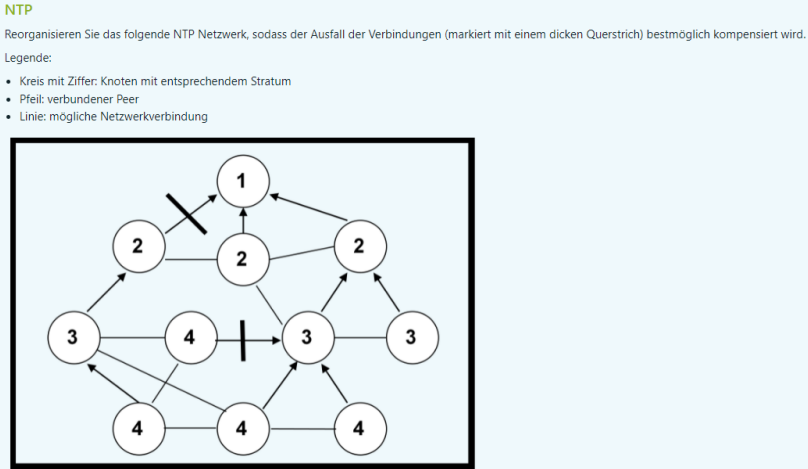
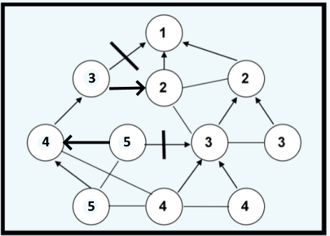

1. Analysieren sie folgendes C-Promm. Welche Fehler können Sie identifizieren (Zeilennummer + Fehlerbeschreibung)? Sie müssen den Code nicht ändern oder erweitern, sondern nur die Fehler beschreiben und die resultierenden möglichen Probleme aufzeigen.

``` cpp
#include "myheader.h" 
#define BUF 1024
#define PORT 6543

int main(void){
    int cs, ns;
    socklen_t addrlen;
    char buffer[BUF];
    struct sockaddr_in addr, cl;
    pid_t pid;

    cs = socket(AF_INET, SOCK_STREAM,0);

    addr.sin_family = AF_INET;

    addr.sin_addr.s_addr = inet_addr("127.0.0.1");//addr.sin_addr.s_addr = "127.0.0.1";
    
    addr.sin_port = htons(PORT);//addr.sin_port = PORT;

    bind(cs,(struct sockaddr*)&addr,sizeof(addr));//Error handling? 

    listen(cs,5);//Error handling? 

    addrlen = sizeof(struct sockaddr_in);

    while(1){//Endlosschleife while(1)?
        printf("Waiting for connections\n");
        ns = accept(cs,(struct sockaddr*)&cl, &addrlen);
        if((pid=fork()) == 0){
        do{
            recv(ns,buffer,BUF-1,0);//recv(ns,buffer,BUF,0);
            buffer[BUF-1] = '\0';//buffer[BUF-1] = '\0';
            printf("Message received: %s",buffer);
        }while(strncmp(buffer, "quit",4) != 0);
        close(ns);//close(cs);
        }
    }
    close(cs);
    return EXIT_SUCCESS;
}
```
Die gegebene C++-Zeile versucht, einen String-Literal "127.0.0.1" einer Variable des falschen Typs zuzuweisen. Um eine IP-Adresse in einer sockaddr_in-Struktur zu setzen, sollte inet_addr oder inet_pton verwendet werden, um die Zeichenkette in das korrekte numerische Format umzuwandeln.

``` cpp
15 addr.sin_addr.s_addr = "127.0.0.1";
15 addr.sin_addr.s_addr = inet_addr("127.0.0.1");
```
Die Codezeile addr.sin_port = PORT;, wenn #define PORT 23123 verwendet wird, könnte aufgrund einer möglichen Überlaufsituation scheitern, da der Portwert außerhalb des gültigen Bereichs für einen 16-Bit-Port liegen könnte. Es wird empfohlen, htons(PORT) zu verwenden, um sicherzustellen, dass der Portwert im richtigen Netzwerkformat liegt und innerhalb des gültigen Bereichs für einen Port liegt.

``` cpp
16 addr.sin_port = PORT;
16 addr.sin_port = htons(PORT);
```
Hier sollte eventuell Error Handling eingebaut werden, bei einem Fehlschlag wird -1 zurückgegeben und das Programm soll abgebrochen werden ansonsten kann Programm weiterlaufen.

``` cpp
18 bind(cs,(struct sockaddr*)&addr,sizeof(addr));

if(bind(cs,(struct sockaddr*)&addr,sizeof(addr)) == -1){
    fprintf(stderr,"Error occoured while binding serversocket");
}
```
Auch hier wird kein Error Handling betrieben.

``` cpp
19 listen(cs,5);

if(listen(cs,5); == -1){
    fprintf(stderr,"Error occoured while listening for clients");
}
```
Endlosschleife macht in diesem Fall vielleicht wenig Sinn, hier würde ich Vorschlagen, einen Index zu erstellen, der bis 5 Clients hochzählt und dann, mit waitpid() warten bis alle Clients terminiert sind und dann serversocket schließen und mit EXIT_SUCCESS Programm beenden.

``` cpp
23 while(1){}
int i = 0;
while(i < 5){
    .
    .
    .
    i++;
}
int status;
pid_t child_pid;
while ((child_pid = waitpid(-1, &status, 0)) > 0) {
    if (WIFEXITED(status)) {
        std::cout << "Child process " << child_pid << " terminated with status: " << WEXITSTATUS(status) << std::endl;
    } else if (WIFSIGNALED(status)) {
        std::cout << "Child process " << child_pid << " terminated by signal: " << WTERMSIG(status) << std::endl;
    }
}
```
Das letzte Element enthält keinen Null Terminator, es könnte also zu undefiniertem Verhalten kommen, da auf Speicheradressen zugegriffen wird, auf die nicht zugegriffen werden sollte. Daher muss 1 vom Buffer abgezogen werden und das letzte Element mit einem NUll Terminator versehen werden.

``` cpp
28 recv(ns,buffer,BUF,0);
28 recv(ns,buffer,BUF-1,0);
29 buffer[BUF-1] = '\0';
```
Hier wird der Serversocket geschlossen obwohl man hier eigentlich den Client schließen möchte.

``` cpp
31 close(cs);
close(ns);
```

2. Klassifizieren Sie den Servertyp des untenstehenden C-Programms anhand der folgenden KAtegorien und begründen Sie Ihre Entscheidung:
- stateful/stateless
- connection oriented/connectionless
- iterative/concurrent

Stateful/Stateless:
The server maintains state by accepting multiple connections in a loop and creating a child process for each connection using fork(). Each child process handles its connection independently. The child processes share the same file descriptors, so they may share some state.
It's more accurate to say that each connection handled by a child process is stateful for the duration of that connection, but the overall server can be considered stateless between different connections.
Connection 

Oriented/Connectionless:
The server uses TCP (SOCK_STREAM), which is a connection-oriented protocol. This means that a reliable, two-way communication channel is established between the server and the client.

Iterative/Concurrent:
The server is concurrent because it uses fork() to create a new process for each incoming connection. This allows the server to handle multiple connections simultaneously.

In summary:
Stateful/Stateless: Stateless overall but stateful during each connection.
Connection Oriented/Connectionless: Connection-oriented (uses TCP).
Iterative/Concurrent: Concurrent (uses fork for handling multiple connections simultaneously).

---

NTP
Reorganisiren Sie das folgende NTP Netzwerk, sodass der Ausfall der Verbindungen (markiert mit einem dicken Querstrich) bestmöglich kompensiert wird:
- Kreis mit ZIffer: Knoten mit entsprechendem Stratum
- Pfeil: verbundener Peer
- Linie: mögliche Netzwerkverbindung





---

Ldap
1. Geben sie einen syntaktisch korrekten LDAP Suchfilter an, der alle Einträge des LDAP Verzeichnisses mit der Suchbasis "dc=technikum-wien,dc=at" liefert, deren Nachname (Attribut sn) mit M oder N beginnen und die in der Organisationseinheit (Attribut) BMR oder BWI zu finden sind.

(&(objectClass=*)(sn=M* | sn=N*)(|(ou=BMR)(ou=BWI))(dc=technikum-wien,dc=at))

Hier eine Erklärung der Bestandteile des Filters:

- (&(objectClass=*)...): Stellt sicher, dass die Einträge mindestens eine Objektklasse haben.
- (sn=M* | sn=N*): Sucht nach Einträgen, deren Nachname mit M oder N beginnt.
- (|(ou=BMR)(ou=BWI)): Überprüft, ob die Einträge in einer der Organisationseinheiten BMR oder BWI zu finden sind.
- (dc=technikum-wien,dc=at): Setzt die Suchbasis auf "dc=technikum-wien,dc=at".

2. Wie unterscheidet sich eine Ausgabe wenn die Abfrage nicht anonym sondern mit Authentifizierung durchgeführt wird?

?

---

Getopt
1. Ein Programm soll als Optionen -q und -c CONFIGDATEI sowie die Angabe eines Verzeochnisses haben. Wie muss die getopt() Funktion aufgerufen werden, um die Kommandozeile zu analysieren?

``` cpp
#include <iostream>
#include <unistd.h>

int main(int argc, char *argv[]) {
    int opt;
    std::string configFileName;

    while ((opt = getopt(argc, argv, "qc:")) != -1) {
        switch (opt) {
            case 'q':
                // Option -q gefunden
                std::cout << "Option -q gefunden" << std::endl;
                break;
            case 'c':
                // Option -c gefunden, optarg enthält den Dateinamen
                configFileName = optarg;
                std::cout << "Option -c mit Konfigurationsdatei: " << configFileName << std::endl;
                break;
            default:
                // Unbekannte Option oder Fehler
                std::cerr << "Unbekannte Option oder Fehler" << std::endl;
                return 1;
        }
    }

    // Hier kannst du mit dem Wert von optind auf das Verzeichnis zugreifen, falls vorhanden
    if (optind < argc) {
        std::string directoryName = argv[optind];
        std::cout << "Verzeichnis: " << directoryName << std::endl;
    }

    return 0;
}
```


2. Wie ermitteln Sie den Verzeichnisname in diesem Beispiel?

``` cpp
if (optind < argc) {
    std::string directoryName = argv[optind];
    std::cout << "Verzeichnis: " << directoryName << std::endl;
}
```

---

Zeitsynchronisation
1. Berechnen Sie die neue Zeit Tc eines Clients nach dem Algorithmus von Christian. Die Sendezeit des Clients T0=23115. DIe EMpfangszeit des CLients T1=23127. Der Reply des Servers enthält die Serverzeit Ts=23120

---
1. Beschreiben SIe die exakte Ausgabe auf stdout. Ist die Ausgabenreienfolge varaibel oder immer ident? Begründen Sie ihre Antwort.

``` cpp
#include <sys/types.h>
#include <unistd.h>
#include <stdio.h>

int main(){
    pid_t pid;
    int a = 12;
    int b = 5;
    pid = fork();
    switch(pid){
        case -1:
            printf("fork failed"); 
            return -1;
            break;
        case 0:
            sleep(3);
            b = a+1;
            printf("2: a: %d b: %d\n",a,b);
            break;
        default:
            sleep(1);
            a = 3;
            b = 5;
            printf("1: a: %d b: %d\n",a,b);
            break;
    }
    a++;
    b--;
    printf("3: a: %d b: %d\n",a,b);
    return 0;
}
```
Laut mehrfachem Ausführem in der Konsole ist die Ausgabe immer gleich. Dem Aspekt nach zu beurteilen ist die  Ausgabe immer ident.

``` cpp
1: a: 3 b: 5
3: a: 4 b: 4
2: a: 12 b: 13
3: a: 13 b: 12
```


2. Welche Programmierrichtlinie für parallele Prozesse wird verletzt? Erweitern Sie das Programm entsprechend.

Das gegebene Programm verletzt die Programmierrichtlinie für parallele Prozesse, die besagt, dass gemeinsam genutzte Ressourcen, wie z.B. Variablen, durch Mutexe oder andere Mechanismen geschützt werden sollten, um Dateninkonsistenzen und Wettlaufbedingungen zu verhindern.

In diesem Fall teilen sich der Eltern- und der Kindprozess die Variablen `a` und `b` ohne Synchronisierung. Dies könnte zu unvorhersehbarem Verhalten führen, da beide Prozesse gleichzeitig auf die Variablen zugreifen und modifizieren.

Um dies zu beheben, können Sie Mutexe verwenden, um den kritischen Abschnitt zu schützen. Hier ist eine erweiterte Version des Programms mit Mutexen:

```c
#include <sys/types.h>
#include <unistd.h>
#include <stdio.h>
#include <pthread.h>

// Mutex für den kritischen Abschnitt
pthread_mutex_t mutex = PTHREAD_MUTEX_INITIALIZER;

int main() {
    pid_t pid;
    int a = 12;
    int b = 5;
    pid = fork();

    switch (pid) {
    case -1:
        printf("fork failed");
        return -1;
        break;
    case 0:
        sleep(3);
        // Kindprozess: Lock den Mutex, um auf gemeinsame Variablen zuzugreifen
        pthread_mutex_lock(&mutex);
        b = a + 1;
        printf("2: a: %d b: %d\n", a, b);
        pthread_mutex_unlock(&mutex); // Unlock den Mutex
        break;
    default:
        sleep(1);
        // Elternprozess: Lock den Mutex, um auf gemeinsame Variablen zuzugreifen
        pthread_mutex_lock(&mutex);
        a = 3;
        b = 5;
        printf("1: a: %d b: %d\n", a, b);
        pthread_mutex_unlock(&mutex); // Unlock den Mutex
        break;
    }

    // Beide Prozesse können jetzt auf gemeinsame Variablen zugreifen, ohne Konflikte
    pthread_mutex_lock(&mutex);
    a++;
    b--;
    printf("3: a: %d b: %d\n", a, b);
    pthread_mutex_unlock(&mutex); // Unlock den Mutex

    return 0;
}
```

In dieser Version wurde ein Mutex (`mutex`) hinzugefügt, und der kritische Abschnitt, in dem auf gemeinsame Variablen zugegriffen wird, wird mit `pthread_mutex_lock` und `pthread_mutex_unlock` geschützt. Dies stellt sicher, dass nur ein Prozess gleichzeitig auf die gemeinsamen Variablen zugreifen kann, um Dateninkonsistenzen zu verhindern.


